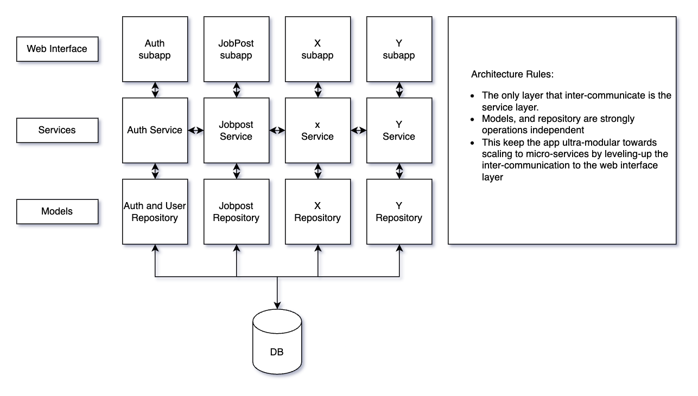

# FastBigAPI architecture example for HRFLOW(simple management of jobposts and applications)

HRFlow contains to subapplication to manage authentication, jobposts, and application. 

## Architecture

## Hrflow Api Documentation 
This project uses openapi to document the REST api communication interface consider using: 
* `/auth/docs` to access the openapi interface to create accounts and login. 
* `/job/docs` to access the open api interface of job subapp with jobpost controller and application controller.

### How to ?

#### Install

make install

#### Test
make test

#### Run
make run